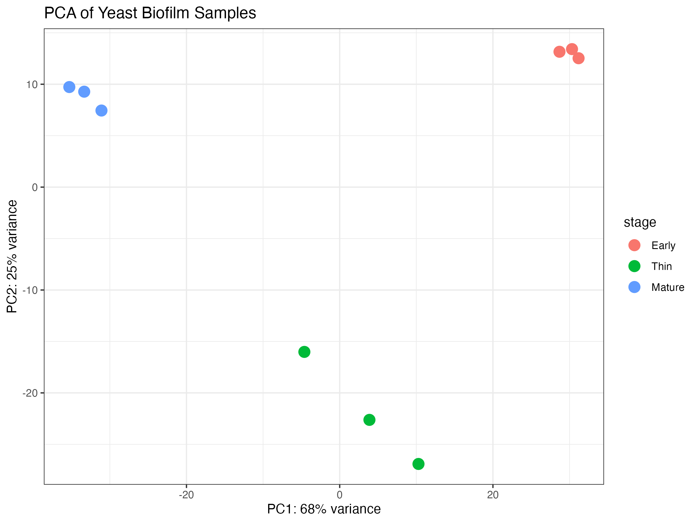
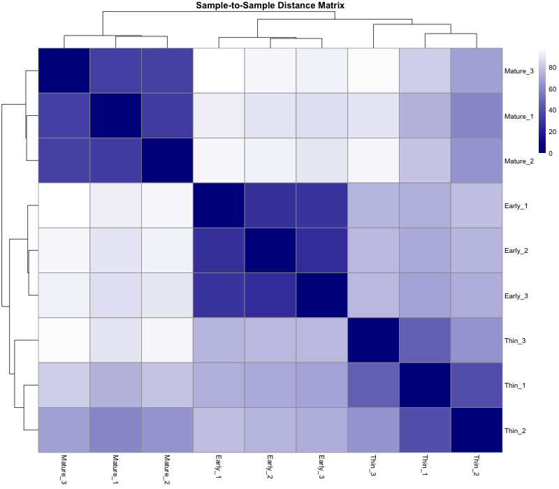
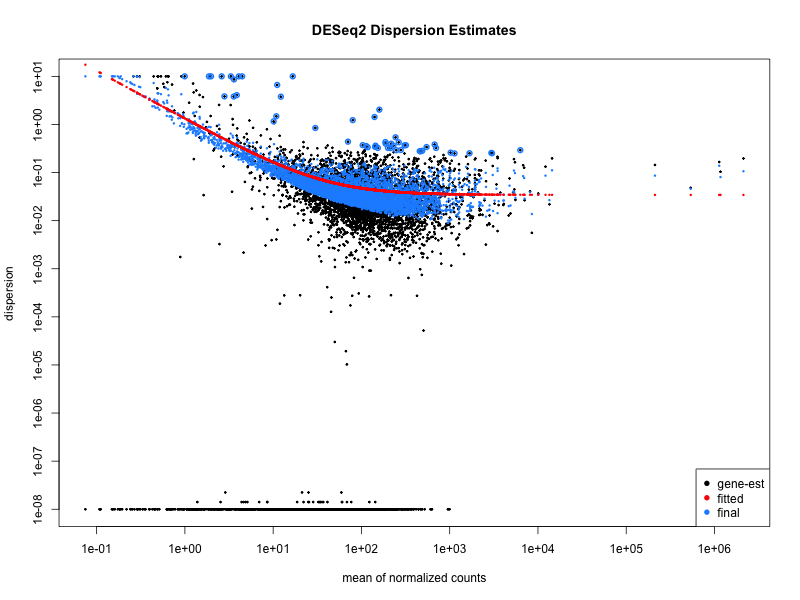
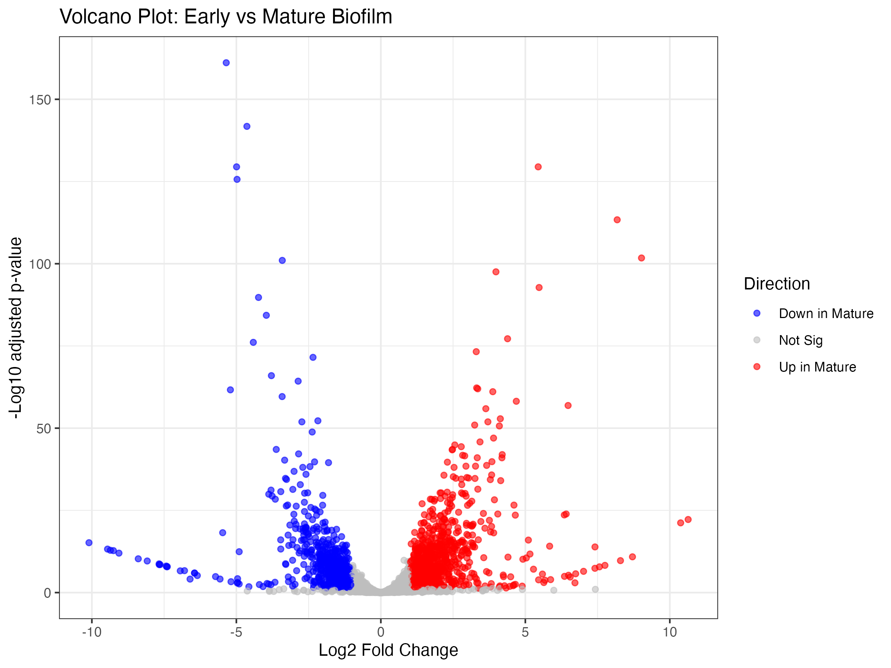
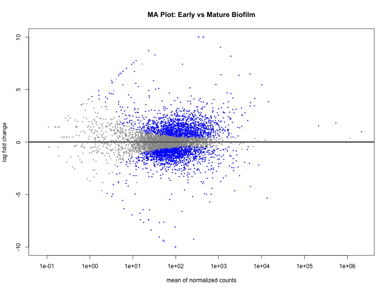
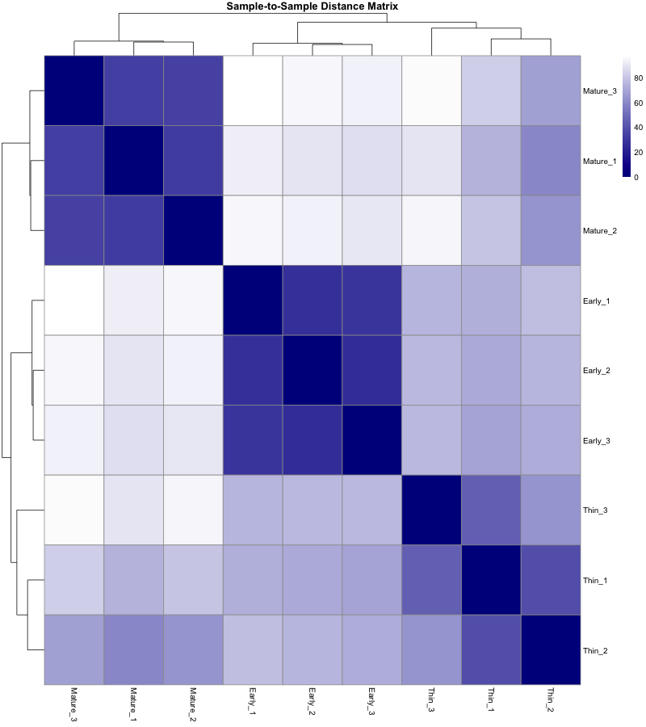
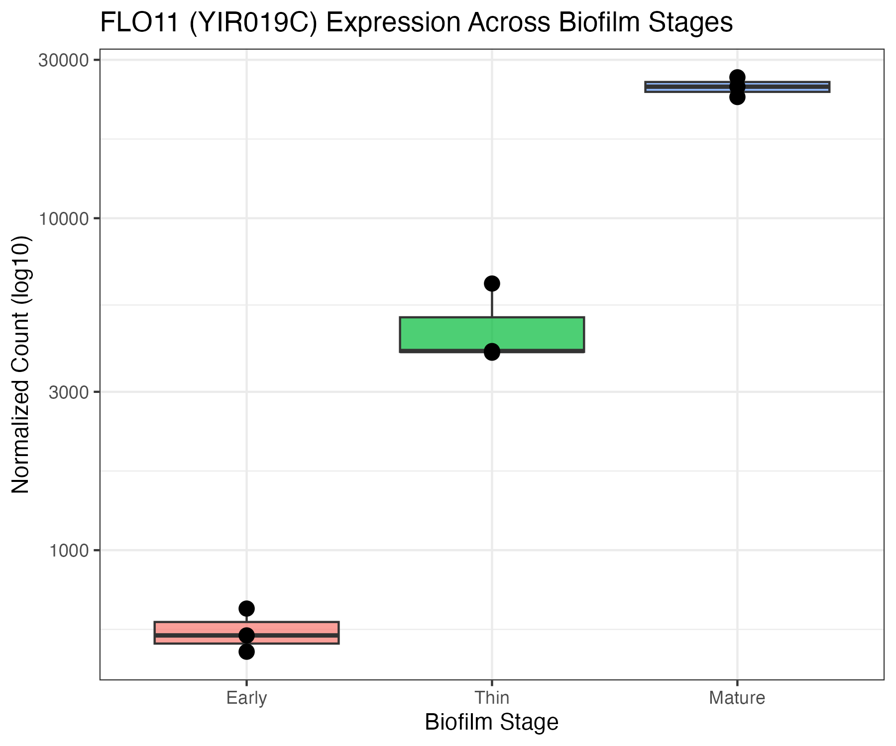
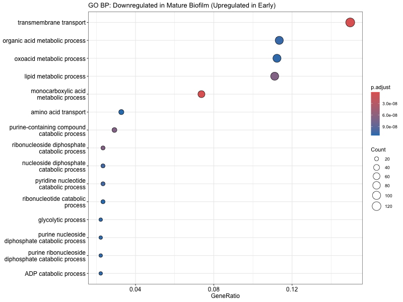
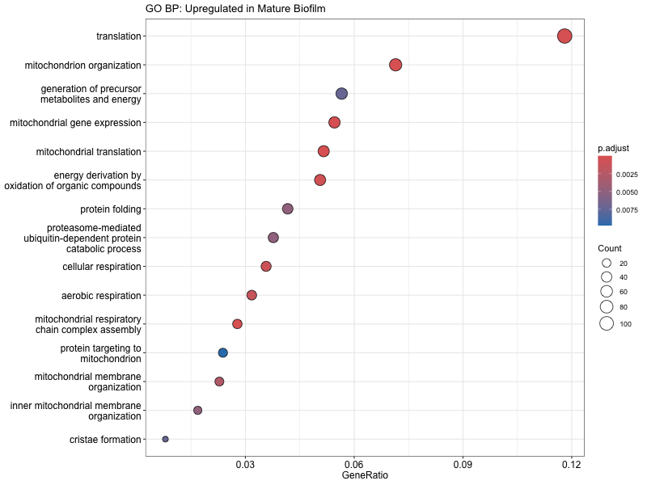

# BINF6110 Assignment 2: Differential Expression Analysis of Yeast Biofilm Development

**Course:** BINF*6110 - Applied Bioinformatics  
**Dataset:** Mardanov et al. 2020 - *Saccharomyces cerevisiae* strain I-329  
**BioProject:** [PRJNA592304](https://www.ncbi.nlm.nih.gov/bioproject/PRJNA592304)

---

## Table of Contents
1. [Introduction](#introduction)
2. [Methods](#methods)
3. [Results](#results)
4. [Discussion](#discussion)
5. [References](#references)

---
## Introduction

*Saccharomyces cerevisiae* is a single-celled fungal microorganism and one of the most well-studied eukaryotes in biology (Parapouli et al., 2020). It is widely used in the production of fermented foods and beverages including wine, beer, and bread, and serves as a model organism for studying eukaryotic cell biology (Mbuyane et al., 2021). Beyond its role in standard fermentation, certain strains of *S. cerevisiae* are capable of forming a surface biofilm, where cells stick to each other and the surface (Speranza et al., 2020). This is also known as velum, or flor, on the surface of aging wine (David-Vaizant & Alexandre, 2018). This biofilm is formed through a structured, multi-stage developmental process that plays a central role in the production of biologically aged wines such as fino sherry, contributing characteristic aldehyde and acetal aromas to the final product (David-Vaizant & Alexandre, 2018).

As environmental conditions change throughout fermentation, the yeast must transition from active fermentation to a biofilm lifestyle under increasingly nutrient-poor conditions (Mardanov et al., 2020). This transition requires transcriptional reprogramming, thousands of genes must be switched on or off as the yeast adapts its metabolism, cell wall structure, and stress responses (Mardanov et al., 2020). Understanding which genes drive this transition has practical implications for controlling wine quality and for the broader biology of yeast stress adaptation.

A central molecular driver of *S. cerevisiae* biofilm formation is *FLO11*, which encodes a GPI-anchored cell wall glycoprotein that mediates cell-cell and cell-surface adhesion (Bou Zeidan et al., 2013). Its expression is tightly regulated by nutrient-sensing signalling pathways, making it a key link between environmental conditions and biofilm structure (Bou Zeidan et al., 2013). However, biofilm development involves more than adhesion, it requires coordinated changes in metabolism, cell wall composition, and stress tolerance that are not yet fully characterized at the gene level (Irianto et al., 2025).

Mardanov et al. (2020) addressed this by profiling gene expression in *S. cerevisiae* strain I-329, an industrial flor yeast, across three stages of velum development: early biofilm (day 38), thin biofilm (day 83), and mature biofilm (day 109). Their published metadata reveals a clear environmental gradient across these stages: glucose drops from 0.2 g/L in early biofilm to less than 0.1 g/L in mature biofilm, ethanol decreases from 12.4% to 9.6% v/v, and aldehyde concentrations increase from 382.8 to 668.8 mg/L. This provides a well-characterized chemical backdrop against which transcriptional changes can be interpreted (Mardanov et al., 2020). Despite its importance to the wine industry, the gene-level transcriptional changes driving each stage of velum maturation remain incompletely characterized.

In this study, we reanalyze the Mardanov et al. (2020) dataset to identify the key genes and biological pathways driving each stage of velum development in *S. cerevisiae* strain I-329. Using RNA-seq data from nine samples across three developmental stages, we quantify gene expression, identify differentially expressed genes, and perform functional annotation to characterize the transcriptional changes underlying the transition from early to mature biofilm.

---
## Methods

### Data Acquisition

RNA-seq data for *S. cerevisiae* strain I-329 were obtained from the NCBI Sequence Read Archive under BioProject PRJNA592304 (Mardanov et al., 2020). Nine samples were downloaded using fasterq-dump v3.2.1 from the NCBI SRA toolkit, corresponding to three biological replicates at each of three velum developmental stages: early biofilm (SRR10551663–SRR10551665, day 38), thin biofilm (SRR10551660–SRR10551662, day 83), and mature biofilm (SRR10551657–SRR10551659, day 109). Reads were confirmed to be single-end upon download. The *S. cerevisiae* R64 reference transcriptome (GCF_000146045.2_R64_rna.fna.gz) and genome (GCF_000146045.2_R64_genomic.fna.gz) were downloaded from NCBI RefSeq for use in quantification and decoy index construction.

### Quality Control

Raw read quality was assessed for all nine samples using FastQC v0.12.1. FastQC was chosen because it provides a comprehensive and standardized set of quality metrics including per-base quality scores, sequence length distribution, GC content, adapter content, and duplication levels, allowing identification of systematic issues before quantification (Andrews, 2010). Results from all nine samples were aggregated into a single interactive HTML report using MultiQC v1.33, which allows direct visual comparison of quality metrics across all samples simultaneously to identify outliers (Ewels et al., 2016). Mapping rates from Salmon quantification (described below) were additionally extracted from the `aux_info/meta_info.json` output file produced for each sample as a secondary quality metric confirming successful quantification. Adapter trimming was not performed prior to quantification as it has been shown to provide minimal benefit when using pseudoaligners on modern sequencing data, and can, in some cases, introduce biases by artificially truncating reads (Liao & Shi, 2020). GC bias correction was not applied as the dataset consists of standard RNA-seq reads with no known GC content issues reported in the original study.

### Quantification

Reads were quantified using Salmon v1.10.2, a quasi-mapping-based pseudoaligner (Patro et al., 2017). Salmon was chosen over alignment-based tools such as STAR or HISAT2 because the *S. cerevisiae* genome is comprehensively annotated, and the goal of this study is gene-level quantification of known transcripts rather than novel isoform or splice site discovery, which are the primary use cases for full alignment (Patro et al., 2017). Salmon is substantially faster than alignment-based tools while producing equally accurate expression estimates for well-annotated genomes (Patro et al., 2017).

A decoy-aware index was constructed using the full *S. cerevisiae* R64 genome as a decoy sequence. Without a decoy, reads originating from genomic regions that share sequence similarity with transcripts can be incorrectly assigned, inflating expression estimates. Including the genome as a decoy forces Salmon to consider these alternative mapping locations and reduces spurious quantification (Srivastava et al., 2020). Genome chromosome names were extracted to serve as the decoy list, and the transcriptome and genome were concatenated into a single gentrome file with the transcriptome placed first as required by Salmon. Salmon v1.10.2 was then run for each sample with the following parameters:

- `-l A` : automatic library type detection, which determines strandedness and read orientation directly from the data. All samples were confirmed as unstranded single-end (library type U)
- `--validateMappings` : enables selective alignment, which validates quasi-mappings against the full index to improve mapping accuracy by rescuing reads that would otherwise be incorrectly mapped or discarded
- `-p 4` : parallelizes computation across four threads to reduce runtime

Full bash commands are provided in `code/salmon_pipeline.sh`.

### Differential Expression Analysis

All downstream analysis was performed in R v4.5.1. R was chosen over Python-based alternatives because the Bioconductor ecosystem provides the most mature and widely validated suite of tools for RNA-seq analysis, including DESeq2, tximport, and clusterProfiler, all of which have extensive documentation, active maintenance, and peer-reviewed publications supporting their use (Muzellec et al., 2023).

Salmon output was imported using tximport v1.36.1. tximport was used rather than count-based tools such as featureCounts or HTSeq because it is specifically designed to work with pseudoalignment output from tools like Salmon (Soneson et al., 2016). Unlike featureCounts and HTSeq, which require a genome-aligned BAM file, tximport works directly with transcript-level abundance estimates and aggregates them to gene-level counts while propagating quantification uncertainty into the downstream statistical model. This approach has been shown to improve the sensitivity and accuracy of differential expression results compared to simple count summarization (Soneson et al., 2016).

A transcript-to-gene mapping was constructed from the NCBI RefSeq GTF annotation for *S. cerevisiae* R64 using GenomicFeatures v1.60.0. GenomicFeatures was used rather than a pre-built tx2gene table because it constructs the mapping directly from the same annotation file used to build the Salmon index, ensuring complete consistency between the quantification and the gene-level summarization (Lawrence et al., 2013). Transcript version numbers were removed from IDs to ensure compatibility with Salmon output.

Differential expression analysis was performed using DESeq2 v1.48.2 (Love et al., 2014). DESeq2 was chosen over EdgeR because it is specifically designed to handle experiments with small numbers of replicates. With only three samples per group, estimating gene-level variability from the data alone is unreliable. DESeq2 addresses this by pooling information across all genes to produce more stable variability estimates for each individual gene, which reduces false positives. It models count data using a negative binomial distribution, which accounts for the fact that variance in RNA-seq data tends to exceed the mean. A DESeq2 object was created using `DESeqDataSetFromTximport()` with biofilm stage as the experimental factor, with levels ordered Early → Thin → Mature. Three pairwise comparisons were performed: Early vs. Thin, Early vs. Mature, and Thin vs. Mature. Pairwise comparisons were chosen over a likelihood ratio test (LRT) time-course model because the three stages represent biologically distinct conditions rather than evenly spaced time points, and pairwise results allow direct interpretation of which genes change between specific stages.

Genes with Benjamini-Hochberg adjusted p-value < 0.05 were considered statistically significant, controlling the false discovery rate at 5% so that on average no more than 5% of genes called significant are expected to be false positives. An additional |log2 fold change| > 1 threshold was applied to restrict results to genes showing at least a 2-fold change in expression, as smaller fold changes are unlikely to be biologically meaningful in the context of a major developmental transition such as biofilm maturation.

### Visualization

Variance-stabilizing transformation (VST) was applied to normalized count data prior to all visualization using DESeq2's `vst()` function. VST was chosen over simple log2 transformation because it stabilizes variance across the full range of mean expression values, preventing highly expressed genes from dominating distance-based analyses. VST was preferred over DESeq2's alternative rlog transformation because rlog is substantially slower, and for a nine-sample dataset, both transformations produce comparable results, making VST the more practical choice (Love et al., 2014).

**QC Visualization**

Principal component analysis (PCA) was performed on VST-transformed data to assess overall sample relationships and confirm that biofilm stage was the primary source of transcriptional variation. Individual sample labels were added using ggrepel v0.9.1 to allow identification of individual replicates. A sample-to-sample distance matrix was computed from VST-transformed data using Euclidean distance to provide a complementary view of replicate consistency alongside PCA. DESeq2 dispersion estimates were plotted using `plotDispEsts()` to confirm appropriate model fit. A well-fitted model would show gene-level dispersion estimates shrinking towards the fitted trend curve with few outliers.

**Differential Expression Visualization**

A volcano plot was generated for the Early vs. Mature comparison, as it represented the most biologically divergent stages with the largest number of DE genes. The top 15 most significant genes were labelled using ggrepel v0.9.1 to identify key genes directly on the plot. An MA plot was generated for the same comparison using DESeq2's `plotMA()` to visualize the relationship between fold change and mean expression level, confirming that differential expression was not biased towards highly or lowly expressed genes. A heatmap of the top 30 most significant DE genes was produced using pheatmap v1.0.12. Yeast genes are identified in the reference genome by systematic ORF identifiers such as YIR019C, which are not biologically informative on their own. To make results interpretable, ORF IDs were converted to standard gene names (e.g. *FLO11*, *TDH1*) using org.Sc.sgd.db v3.21.0, an R annotation package maintained by the Saccharomyces Genome Database (SGD) that maps every yeast ORF to its curated gene name and functional annotation. This database was used over generic annotation tools because it is the community-standard resource for *S. cerevisiae* gene annotation. Normalized expression counts for *FLO11* (YIR019C) were plotted across all three stages using DESeq2's `plotCounts()` to directly illustrate the progressive upregulation of the key biofilm adhesion gene. All plots were produced using ggplot2 v3.5.1 within R v4.5.1.

### Functional Annotation

Functional annotation was performed using Gene Ontology over-representation analysis (ORA) via clusterProfiler v4.16.0 (Wu et al., 2021). ORA was chosen over gene set enrichment analysis (GSEA) because the goal here is to identify which biological processes are statistically overrepresented in discrete sets of significant DE genes, rather than ranking all genes by a continuous enrichment score. ORA applies a hypergeometric test to determine whether each GO term appears more frequently among DE genes than expected by chance, given the background of all expressed genes in this dataset.

The Biological Process (BP) ontology was used rather than Molecular Function or Cellular Component because BP terms describe the biological roles and pathways genes participate in, which is the most relevant level of annotation for interpreting transcriptional changes accompanying a major developmental transition. Genes from the Early vs. Mature comparison were split into upregulated and downregulated sets and analyzed separately to preserve directionality and distinguish processes that are activated from those that are repressed during biofilm maturation. A background of all expressed genes was used rather than all annotated genes in the genome, as genes not detected in this experiment cannot be considered part of the testable universe. Multiple testing correction was applied using the Benjamini-Hochberg method with padj < 0.05. A secondary qvalueCutoff of 0.2 was applied as an additional filter, which controls the proportion of false positives among significant results using the q-value framework independently of the adjusted p-value, providing greater confidence in reported terms (Wu et al., 2021). Full R code is provided in `code/deseq2_analysis.R`.

---
## Results

### Quality Control

FastQC analysis of all nine raw read files confirmed acceptable sequencing quality across all samples. Per-base sequence quality scores and per-sequence quality scores passed for all nine samples, indicating high base-call accuracy throughout the reads. Sequence length distribution and adapter content also passed for all samples, confirming that reads were of consistent length and free of adapter contamination. Two modules failed across all samples, per-base sequence content and sequence duplication levels, however both of these are expected and well-documented artefacts of RNA-seq data rather than indicators of poor quality (Hansen et al., 2010). Per-base sequence content failure at the 5' end of reads is a known consequence of random hexamer priming during library preparation, which introduces a non-uniform nucleotide composition at the beginning of reads (Hansen et al., 2010). Sequence duplication level failure is expected in RNA-seq because highly expressed genes naturally produce many identical reads, unlike in genomic DNA sequencing for which this metric was designed. Per-sequence GC content showed warnings in six of nine samples, but no extreme deviation from the expected GC distribution was observed that would indicate contamination or systematic bias. Taken together, the FastQC results indicate that all nine samples are of sufficient quality for downstream quantification without adapter trimming.

Salmon mapping rates ranged from 73.7% to 92.1% across all nine samples (Table 1). Mature and Early biofilm samples showed consistently high mapping rates between 81.9% and 92.1%. Two Thin biofilm samples showed lower mapping rates of 73.7% (SRR10551660) and 76.5% (SRR10551661), which may reflect greater transcriptional complexity or a higher proportion of novel or unannotated transcripts at this transitional developmental stage. All mapping rates are within acceptable thresholds for RNA-seq analysis with a well-annotated reference genome.

**Table 1: Salmon Mapping Rates by Sample**

| Sample | Stage | Mapping Rate (%) |
|---|---|---|
| SRR10551663 | Early | 85.45 |
| SRR10551664 | Early | 84.57 |
| SRR10551665 | Early | 85.52 |
| SRR10551660 | Thin | 73.75 |
| SRR10551661 | Thin | 76.49 |
| SRR10551662 | Thin | 92.06 |
| SRR10551657 | Mature | 82.95 |
| SRR10551658 | Mature | 81.87 |
| SRR10551659 | Mature | 83.26 |

### Overall Sample Structure

PCA of variance-stabilized gene expression data across all nine samples revealed clear and consistent separation of the three biofilm developmental stages (Figure 1). PC1 accounted for 68% of total variance and separated samples along the developmental axis, Early biofilm samples clustered at positive PC1 values, Mature biofilm samples at negative PC1 values, and Thin biofilm samples were positioned intermediate between the two. PC2 accounted for an additional 25% of variance and further distinguished the Thin biofilm samples, which showed greater spread along this axis than either Early or Mature samples. This greater spread likely reflects the more variable or transitional transcriptional state of the Thin biofilm stage. Within each stage, biological replicates clustered tightly, confirming high reproducibility across samples. Together, PC1 and PC2 capture 93% of total variance, indicating that biofilm developmental stage is the dominant source of transcriptional variation in this dataset.

**Figure 1:** Principal component analysis of variance-stabilized gene expression data from nine *S. cerevisiae* samples across three biofilm developmental stages (Early, Thin, Mature; n=3 per stage). PC1 (68% variance) separates samples along the developmental trajectory. PC2 (25% variance) further distinguishes the thin biofilm stage. Individual sample IDs are labelled.

The sample-to-sample distance heatmap confirmed these relationships quantitatively (Figure 2). Early and Mature biofilm samples showed the largest pairwise distances from each other, consistent with their opposing positions on PC1. Thin biofilm samples showed intermediate distances to both groups. Within each stage, pairwise distances between replicates were small, confirming the tight replicate clustering observed in the PCA.

**Figure 2:** Sample-to-sample distance matrix computed from Euclidean distances of variance-stabilized expression data. Darker blue indicates greater similarity between samples.

The DESeq2 dispersion plot confirmed that the model fit was appropriate for this dataset (Figure 3). Gene-wise dispersion estimates followed the expected trend, with higher dispersion at low mean counts shrinking toward the fitted curve, and final estimates clustering tightly around the trend line with only a small number of outliers flagged. This indicates that DESeq2's shrinkage procedure performed as expected and that the negative binomial model is well-suited to this data.

**Figure 3:** DESeq2 dispersion estimates. Black points = gene-wise estimates; red line = fitted trend; blue points = final shrunken estimates. Circled points = genes flagged as dispersion outliers.

### Differential Expression Analysis

DESeq2 pairwise comparisons identified widespread transcriptional changes at all three stage transitions (Table 2). The largest number of differentially expressed genes was observed between the Early and Mature stages, with 1,541 genes upregulated and 1,427 genes downregulated in Mature relative to Early (padj < 0.05, |log2FC| > 1), representing approximately 50% of all 5,958 expressed genes. This scale of differential expression indicates a genome-wide transcriptional shift accompanying biofilm maturation rather than a targeted response involving a small number of genes.

**Table 2: Summary of Differential Expression Results**

| Comparison | Upregulated | Downregulated | Total DE Genes |
|---|---|---|---|
| Early vs. Thin | 1,110 | 1,084 | 2,194 |
| Early vs. Mature | 1,541 | 1,427 | 2,968 |
| Thin vs. Mature | 1,225 | 1,127 | 2,352 |

The volcano plot for the Early vs. Mature comparison shows the distribution of fold changes and statistical significance across all expressed genes, with the top 15 most significant genes labeled (Figure 4). Several genes showed extreme fold changes exceeding |log2FC| = 5, and the most significant genes reached -log10(padj) values above 100, reflecting the high confidence and large magnitude of expression changes between these two developmental extremes. The most significantly downregulated gene in Mature biofilm was *TDH1* (YJL052W, log2FC = −5.35), encoding a glycolytic enzyme, while the most significantly upregulated gene was *FLO11* (YIR019C, log2FC = +5.45), encoding the key biofilm adhesion glycoprotein. The MA plot confirmed that differentially expressed genes were distributed across the full range of mean expression values, with no systematic bias toward highly or lowly expressed genes (Figure 5).

**Figure 4:** Volcano plot of differential gene expression between Early and Mature biofilm stages. Red = significantly upregulated in Mature (padj < 0.05, log2FC > 1); Blue = significantly downregulated in Mature; Grey = not significant. Top 15 most significant genes are labeled.

**Figure 5:** MA plot for the Early vs. Mature comparison. Blue points = significantly differentially expressed genes (padj < 0.05). The distribution of significant genes across the full range of mean expression confirms no expression-level bias in the analysis.

The heatmap of the top 30 most significant DE genes reveals two major clusters of co-regulated genes with opposing expression patterns across developmental stages (Figure 6). The upper cluster contains genes with highest expression in Early biofilm that decline progressively through Thin to Mature, including glycolytic enzymes *TDH1*, *PGK1*, *FBA1*, and *ENO2*, the high-affinity glucose transporter *HXT1*, and the pyruvate decarboxylase *PDC6*. Together, these genes describe an active fermentative metabolism in Early biofilm when glucose is still available. The lower cluster contains genes with lowest expression in Early biofilm that increase progressively with development, including the biofilm adhesion gene *FLO11*, cell wall proteins *PIR1* and *CIS3*, the gluconeogenic enzyme *PCK1*, and the stress response chaperone *SSE1*. Thin biofilm samples show intermediate expression levels between the two extremes, consistent with their transitional position in the developmental trajectory.

**Figure 6:** Heatmap of the top 30 most significant DE genes between Early and Mature biofilm stages, ranked by adjusted p-value. Expression values are row-scaled (z-score). Column annotation indicates biofilm stage. Gene labels show common name and ORF ID.

The top 10 most significant DE genes from the Early vs. Mature comparison are summarized in Table 3. Full results for the top 20 genes are available in `results/top_genes.csv`.

**Table 3: Top 10 Most Significant DE Genes (Early vs. Mature Biofilm)**

| Gene | ORF | log2FC | padj |
|---|---|---|---|
| TDH1 | YJL052W | −5.350 | 7.62×10⁻¹⁶² |
| OLE1 | YGL055W | −4.635 | 1.70×10⁻¹⁴² |
| PDC6 | YGR087C | −4.993 | 3.47×10⁻¹³⁰ |
| FLO11 | YIR019C | +5.446 | 3.47×10⁻¹³⁰ |
| HXT1 | YHR094C | −4.976 | 2.21×10⁻¹²⁶ |
| MAN2 | YNR073C | +8.179 | 4.33×10⁻¹¹⁴ |
| DAL5 | YJR152W | −3.411 | 9.73×10⁻¹⁰² |
| PIR1 | YKL164C | +3.983 | 2.89×10⁻⁹⁸ |
| HXT17 | YNR072W | +5.477 | 1.70×10⁻⁹³ |
| PGK1 | YCR012W | −4.233 | 1.78×10⁻⁹⁰ |

### FLO11 Expression Across Biofilm Stages

To directly verify the upregulation of the key biofilm adhesion gene across development, normalized expression counts for *FLO11* (YIR019C) were plotted across all three stages (Figure 7). *FLO11* showed a clear and progressive increase in expression from Early to Mature biofilm, with normalized counts rising approximately 45-fold from Early to Mature. Replicates within each stage were tightly grouped, particularly in the Mature stage, confirming that this upregulation is consistent and reproducible rather than driven by a single outlier replicate. This pattern directly supports the role of *FLO11* as a central driver of velum consolidation as the biofilm matures and glucose is depleted.

**Figure 7:** Normalized expression counts for *FLO11* (YIR019C) across Early, Thin, and Mature biofilm stages (n=3 per stage). Y-axis is log10 scaled. Individual replicate values are overlaid on boxplots.

### Functional Annotation

GO Biological Process ORA of genes downregulated in Mature biofilm (genes most highly expressed in Early biofilm) identified significant enrichment of transmembrane transport (GeneRatio ~0.13, padj < 1×10⁻¹¹), organic acid metabolic process, oxoacid metabolic process, lipid metabolic process, and glycolytic process (Figure 8). The transmembrane transport term was the largest and most significant, with over 120 genes annotated to this term, reflecting the broad downregulation of nutrient uptake machinery as glucose becomes depleted. The enrichment of glycolytic process confirms the downregulation of core fermentation genes, including *TDH1*, *PGK1*, and *PDC6* observed in the DE analysis. Together, these terms describe an Early biofilm actively importing and fermenting glucose.

**Figure 8:** GO Biological Process over-representation analysis of genes downregulated in Mature biofilm (upregulated in Early), from the Early vs. Mature pairwise comparison. Dot size = number of DE genes annotated to each term; colour = adjusted p-value (red = more significant). Background = all expressed genes.

GO BP ORA of genes upregulated in Mature biofilm revealed a different metabolic program (Figure 9). The most enriched term by GeneRatio was translation (GeneRatio ~0.12), followed by mitochondrion organization, generation of precursor metabolites and energy, mitochondrial gene expression, mitochondrial translation, energy derivation by oxidation of organic compounds, cellular respiration, aerobic respiration, and mitochondrial respiratory chain complex assembly. The dominance of mitochondrial and respiratory terms indicates that Mature biofilm cells are shifting away from fermentation and toward oxidative phosphorylation as their primary energy source — a metabolic transition consistent with the diauxic shift that occurs when glucose is depleted and ethanol becomes the primary carbon source. This shift requires the cell to upregulate the entire mitochondrial machinery, from mitochondrial gene expression and translation to respiratory chain complex assembly. The enrichment of the translation term reflects the large-scale production of new mitochondrial and respiratory proteins required to support this metabolic transition.

**Figure 9:** GO Biological Process over-representation analysis of genes upregulated in Mature biofilm, from the Early vs. Mature pairwise comparison. Dot size = number of DE genes annotated to each term; colour = adjusted p-value.

---
## Discussion

Around half of all active genes changed significantly between the Early and Mature stages of the velum biofilm. This is a large proportion, and the pattern is coherent, it tells a consistent biological story. Early biofilm cells are breaking down sugar and growing actively, while Mature biofilm cells have run low on glucose, stopped fermenting, switched their energy source, and begun building the physical structure of the biofilm. The sections below walk through the main findings and what they mean.

### Fermentation shuts down as glucose runs out

The genes that dropped most sharply in the Mature biofilm are ones involved in breaking down sugar and producing alcohol, exactly what you would expect as glucose becomes scarce.

The single most significantly changed gene in the entire dataset was *TDH1* (32-fold down, padj = 7.62×10⁻¹⁶²). *TDH1* encodes an enzyme called GAPDH, which carries out an essential step in glycolysis, the process yeast use to extract energy from glucose. Interestingly, *TDH1* is the minor, resting-state version of this enzyme that is mainly active when cells are not growing fast, so its downregulation suggests the cells are leaving the active fermentation phase behind entirely.

*PDC6* (32-fold down, padj = 3.47×10⁻¹³⁰) encodes a pyruvate decarboxylase. Unlike the two main isoforms PDC1 and PDC5, PDC6 is not expressed during active glucose fermentation, it appears to function primarily when yeast are growing on non-fermentable carbon sources like ethanol (Hohmann, 1993). Its downregulation in Mature biofilm is therefore not simple to interpret: rather than reflecting a shutdown of fermentation, it may reflect something specific about the nutrient environment of the mature velum that remains to be investigated.

*HXT1* (31-fold down, padj = 2.21×10⁻¹²⁶) encodes a glucose transporter, a protein that sits in the cell membrane and physically imports glucose into the cell (Roy et al., 2015). Crucially, *HXT1* is only switched on when glucose levels are high (Ozcan & Johnston, 1995). The fact that it is almost completely silenced in Mature biofilm is essentially a molecular signal that glucose has been depleted: when there is no glucose to sense, the cell stops producing the machinery to import it.

*OLE1* (25-fold down, padj = 1.7×10⁻¹⁴²) encodes the enzyme responsible for making unsaturated fats, which are needed to keep cell membranes flexible (McDonough et al., 1992). Its downregulation is consistent with cells slowing down their growth and therefore needing less new membrane material.

*DAL5* (10-fold down, padj = 9.73×10⁻¹⁰²) encodes a transporter for nitrogen-containing compounds. Its expression is normally switched off when the cell has plenty of nitrogen available, so its downregulation in Mature biofilm likely reflects a shift in how the cells are managing nitrogen as the environment changes, though exactly what is driving this change would need further investigation (Hellborg et al., 2008).

Taken together, these results are also reflected in the gene ontology analysis: the largest category of genes that were high in Early biofilm and low in Mature biofilm was "transmembrane transport," with over 120 genes involved. This confirms that the cells are shutting down nutrient import across the board as the environment becomes nutrient-poor.

### The biofilm physically consolidates: FLO11 and cell wall changes

The most interesting upregulated gene is *FLO11* (45-fold up, padj = 3.47×10⁻¹³⁰). *FLO11* encodes a large sticky protein anchored to the outside of the yeast cell wall, and it is essential for forming a biofilm, growing filaments, and sticking to surfaces (Bayly et al., 2005). Its strong upregulation in Mature biofilm makes sense as the velum at this stage needs to be a physically stable film floating on the wine surface.

What is particularly interesting is how the cell knows to switch on *FLO11*. It is controlled by two signalling pathways that both respond to nutrient shortage (Halme et al., 2004). So the cell is using the very same glucose depletion signal that shuts down fermentation to simultaneously trigger biofilm consolidation, a single environmental cue drives both the metabolic switch and the structural maturation of the velum (Halme et al., 2004).

Several other genes involved in building and remodelling the cell wall were also strongly upregulated. *PIR1* (15-fold up) encodes a structural cell wall protein (Alvarado et al., 2025). *HXT17* (45-fold up) is a poorly understood member of the glucose transporter family whose role in mature biofilm is unclear; it may be helping the cells scavenge trace amounts of glucose in a near-depleted environment (Raj & Saini, 2024).

### Stress response: coping with ethanol toxicity

*SSE1* (10-fold up) helps other proteins fold correctly and prevents them from clumping together under stressful conditions (Shaner et al., 2008). Its upregulation in Mature biofilm is consistent with the cells experiencing increased stress, most likely from ethanol, which accumulates as fermentation continues and is toxic to cellular proteins even in the yeast that produce it (Shaner et al., 2008). The GO enrichment of protein folding terms in Mature biofilm genes supports the idea that the chaperone system is under increasing pressure as the biofilm ages.

### What this analysis adds beyond Mardanov et al. (2020)

Mardanov et al. (2020) used microarrays to study velum gene expression and identified broad categories of metabolic change. This analysis extends their work in three main ways. First, Salmon quantification with a decoy-aware index is more accurate than traditional microarray hybridisation or read alignment, reducing the risk of counting reads from the wrong gene. Second, DESeq2 with shrinkage estimation provides more reliable statistical calls, especially important when working with only three replicates per group. Third, separating up- and downregulated genes for GO enrichment gives a clearer picture of what the cells are actually switching on versus off. The identification of specific genes and the mitochondrial protein synthesis machinery, provides gene-level detail that complements the broader patterns described in the original study.

### Limitations

This analysis has several limitations worth noting. With only three biological replicates per stage, statistical power is limited. All conclusions are based on mRNA levels; whether these changes are actually reflected in protein levels and enzyme activity would need to be confirmed by follow-up experiments such as qPCR or proteomics. The analysis focused on the Early vs. Mature comparison; examining the Early vs. Thin and Thin vs. Mature transitions separately would give a more complete picture of how the velum develops over time. Finally, the two Thin biofilm samples with lower mapping rates (73.7% and 76.5%) may have less reliable expression estimates, which could contribute to the greater spread of Thin samples seen in the PCA.

---
## References

Alvarado, M., Moreno-Martínez, A. E., Micó, M., Gómez-Navajas, J. A., Blázquez-Abellán, A., Mixão, V., Gabaldón, T., Mateo, E., Valentín, E., & De Groot, P. W. J. (2025). Wall incorporation of the β-1,3-glucan cross-linking protein Pir1 in the human pathogen *Candida albicans* is facilitated by the presence of two or more Pir repeat units. *FEMS Yeast Research*, 25. https://doi.org/10.1093/femsyr/foaf042

Andrews, S. (2010). FastQC a quality control tool for high throughput sequence data. Babraham.ac.uk. https://www.bioinformatics.babraham.ac.uk/projects/fastqc/

Bayly, J., Douglas, L., Pretorius, I., Bauer, F., & Dranginis, A. (2005). Characteristics of Flo11-dependent flocculation in. *FEMS Yeast Research*, 5(12), 1151–1156. https://doi.org/10.1016/j.femsyr.2005.05.004

Bou Zeidan, M., Carmona, L., Zara, S., & Marcos, J. F. (2013). FLO11 gene is involved in the interaction of flor strains of *Saccharomyces cerevisiae* with a biofilm-promoting synthetic hexapeptide. *Applied and Environmental Microbiology*, 79(19), 6023–6032. https://doi.org/10.1128/aem.01647-13

David-Vaizant, V., & Alexandre, H. (2018). Flor yeast diversity and dynamics in biologically aged wines. *Frontiers in Microbiology*, 9. https://doi.org/10.3389/fmicb.2018.02235

Delgado, M. L., O'Connor, J. E., Azorín, I., Renau-Piqueras, J., Gil, M. L., & Gozalbo, D. (2001). The glyceraldehyde-3-phosphate dehydrogenase polypeptides encoded by the *Saccharomyces cerevisiae* TDH1, TDH2 and TDH3 genes are also cell wall proteins. *Microbiology*, 147(2), 411–417. https://doi.org/10.1099/00221287-147-2-411

Ewels, P., Magnusson, M., Lundin, S., & Käller, M. (2016). MultiQC: summarize analysis results for multiple tools and samples in a single report. *GitHub*. https://github.com/MultiQC/MultiQC

Galdieri, L., Mehrotra, S., Yu, S., & Vancura, A. (2010). Transcriptional regulation in yeast during diauxic shift and stationary phase. *OMICS: A Journal of Integrative Biology*, 14(6), 629–638. https://doi.org/10.1089/omi.2010.0069

Halme, A., Bumgarner, S., Styles, C., & Fink, G. R. (2004). Genetic and epigenetic regulation of the FLO gene family generates cell-surface variation in yeast. *Cell*, 116(3), 405–415. https://doi.org/10.1016/s0092-8674(04)00118-7

Hansen, K. D., Brenner, S. E., & Dudoit, S. (2010). Biases in Illumina transcriptome sequencing caused by random hexamer priming. *Nucleic Acids Research*, 38(12), e131–e131. https://doi.org/10.1093/nar/gkq224

Hellborg, L., Woolfit, M., Arthursson-Hellborg, M., & Piškur, J. (2008). Complex evolution of the DAL5 transporter family. *BMC Genomics*, 9(1), 164. https://doi.org/10.1186/1471-2164-9-164

Hohmann, S. (1991). Characterization of PDC6, a third structural gene for pyruvate decarboxylase in *Saccharomyces cerevisiae*. *Journal of Bacteriology*, 173(24), 7963–7969. https://doi.org/10.1128/jb.173.24.7963-7969.1991

Irianto, V. S., Plocek, V., Bharti, R., Maršíková, J., Váchová, L., & Palková, Z. (2025). Spatial structure of yeast biofilms and the role of cell adhesion across different media. *Biofilm*, 10, 100306–100306. https://doi.org/10.1016/j.bioflm.2025.100306

Lawrence, M., Huber, W., Pagès, H., Aboyoun, P., Carlson, M., Gentleman, R., Morgan, M. T., & Carey, V. J. (2013). Software for computing and annotating genomic ranges. *PLoS Computational Biology*, 9(8), e1003118. https://doi.org/10.1371/journal.pcbi.1003118

Liao, Y., & Shi, W. (2020). Read trimming is not required for mapping and quantification of RNA-seq reads at the gene level. *NAR Genomics and Bioinformatics*, 2(3). https://doi.org/10.1093/nargab/lqaa068

Love, M. I., Huber, W., & Anders, S. (2014). Moderated estimation of fold change and dispersion for RNA-seq data with DESeq2. *Genome Biology*, 15(12), 550. https://doi.org/10.1186/s13059-014-0550-8

Mardanov, A. V., Eldarov, M. A., Beletsky, A. V., Tanashchuk, T. N., Kishkovskaya, S. A., & Ravin, N. V. (2020). Transcriptome profile of yeast strain used for biological wine aging revealed dynamic changes of gene expression in course of flor development. *Frontiers in Microbiology*, 11. https://doi.org/10.3389/fmicb.2020.00538

Mbuyane, L. L., Bauer, F. F., & Divol, B. (2021). The metabolism of lipids in yeasts and applications in oenology. *Food Research International*, 141, 110142. https://doi.org/10.1016/j.foodres.2021.110142

McDonough, V. M., Stukey, J. E., & Martin, C. E. (1992). Specificity of unsaturated fatty acid-regulated expression of the *Saccharomyces cerevisiae* OLE1 gene. *The Journal of Biological Chemistry*, 267(9), 5931–5936. https://pubmed.ncbi.nlm.nih.gov/1556107/

Muzellec, B., Teleńczuk, M., Cabeli, V., & Andreux, M. (2023). PyDESeq2: a python package for bulk RNA-seq differential expression analysis. *Bioinformatics*, 39(9). https://doi.org/10.1093/bioinformatics/btad547

Ozcan, S., & Johnston, M. (1995). Three different regulatory mechanisms enable yeast hexose transporter (HXT) genes to be induced by different levels of glucose. *Molecular and Cellular Biology*, 15(3), 1564–1572. https://doi.org/10.1128/mcb.15.3.1564

Parapouli, M., Vasileiadi, A., Afendra, A.-S., & Hatziloukas, E. (2020). *Saccharomyces cerevisiae* and its industrial applications. *AIMS Microbiology*, 6(1), 1–31. https://doi.org/10.3934/microbiol.2020001

Patro, R., Duggal, G., Love, M. I., Irizarry, R. A., & Kingsford, C. (2017). Salmon provides fast and bias-aware quantification of transcript expression. *Nature Methods*, 14(4), 417–419. https://doi.org/10.1038/nmeth.4197

Raj, N., & Saini, S. (2024). Increased privatization of a public resource leads to spread of cooperation in a microbial population. *Microbiology Spectrum*. https://doi.org/10.1128/spectrum.02358-23

Roy, A., Dement, A., Cho, K. R., & Kim, J. H. (2015). Assessing glucose uptake through the yeast hexose transporter 1 (Hxt1). *PLOS ONE*, 10(3), e0121985–e0121985. https://doi.org/10.1371/journal.pone.0121985

Shaner, L., Gibney, P. A., & Morano, K. A. (2008). The Hsp110 protein chaperone Sse1 is required for yeast cell wall integrity and morphogenesis. *Current Genetics*, 54(1), 1–11. https://doi.org/10.1007/s00294-008-0193-y

Soneson, C., Love, M. I., & Robinson, M. D. (2016). Differential analyses for RNA-seq: transcript-level estimates improve gene-level inferences. *F1000Research*, 4, 1521. https://doi.org/10.12688/f1000research.7563.2

Speranza, B., Corbo, M. R., Campaniello, D., Altieri, C., Sinigaglia, M., & Bevilacqua, A. (2020). Biofilm formation by potentially probiotic *Saccharomyces cerevisiae* strains. *Food Microbiology*, 87, 103393. https://doi.org/10.1016/j.fm.2019.103393

Srivastava, A., Malik, L., Sarkar, H., Zakeri, M., Almodaresi, F., Soneson, C., Love, M. I., Kingsford, C., & Patro, R. (2020). Alignment and mapping methodology influence transcript abundance estimation. *Genome Biology*, 21(1). https://doi.org/10.1186/s13059-020-02151-8

Wu, T., Hu, E., Xu, S., Chen, M., Guo, P., Dai, Z., Feng, T., Zhou, L., Tang, W., Zhan, L., Fu, X., Liu, S., Bo, X., & Yu, G. (2021). clusterProfiler 4.0: A universal enrichment tool for interpreting omics data. *The Innovation*, 2(3), 100141.
